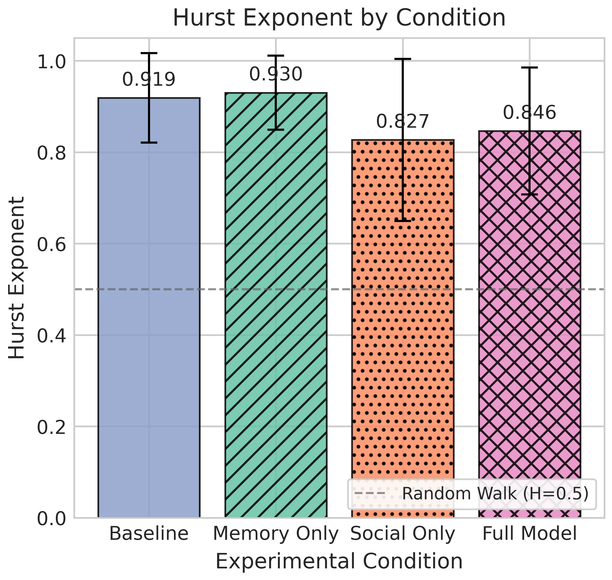
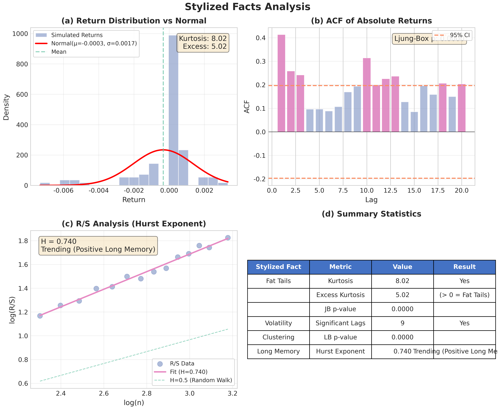
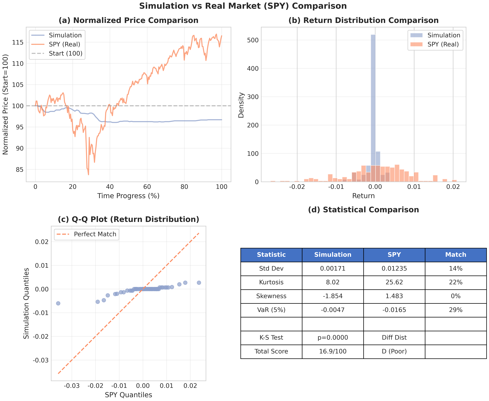

# HerdLLM

> 基于 LLM-Agent 的金融市场羊群效应仿真系统

[](https://www.python.org/)
[](https://python-poetry.org/)
[](LICENSE)

---

## 目录

- [研究背景](#研究背景)
- [项目概述](#项目概述)
- [系统架构](#系统架构)
- [核心机制](#核心机制)
- [安装配置](#安装配置)
- [运行模式](#运行模式)
- [输出结果](#输出结果)
- [实验设计](#实验设计)
- [Stylized Facts 验证](#stylized-facts-验证)
- [真实市场基准对比](#真实市场基准对比)
- [API 参考](#api-参考)
- [技术栈](#技术栈)
- [引用](#引用)
- [License](#license)

---

## 研究背景

### 研究问题

**噪声交易与羊群效应的微观起源是什么？**

传统金融理论假设投资者是理性的，但大量实证研究表明市场中存在显著的噪声交易和羊群行为。本项目通过 Agent-Based Model (ABM) 从微观层面研究这些现象的形成机制。

### 理论基础

| 理论 | 核心观点 | 本项目对应 |
|------|----------|------------|
| **噪声交易者理论** (De Long et al., 1990) | 非理性交易者影响价格 | LLM-Agent 的有限理性决策 |
| **羊群行为理论** (Banerjee, 1992) | 信息级联导致从众 | 社交网络中的行为传播 |
| **行为金融学** (Kahneman & Tversky, 1979) | 认知偏差影响决策 | 记忆模块的经验反思 |
| **复杂系统理论** | 微观交互涌现宏观模式 | ABM 仿真框架 |

---

## 项目概述

HerdLLM 是一个基于大语言模型 (LLM) 的多智能体金融市场仿真系统，用于研究市场微观结构和交易者行为。

### 核心特性

```
┌─────────────────────────────────────────────────────────────┐
│                      HerdLLM 系统                             │
├─────────────────────────────────────────────────────────────┤
│  🤖 LLM-Agent     基于 Ollama 本地大模型的智能决策           │
│  🧠 Memory        历史经验反思与学习                         │
│  🌐 Social Net    Barabási-Albert 无标度社交网络            │
│  📊 Validation    Stylized Facts 金融典型事实验证           │
│  📈 Benchmark     真实市场数据 (SPY) 对比分析               │
│  🔬 Experiment    2×2 对照实验设计 + Monte Carlo            │
└─────────────────────────────────────────────────────────────┘
```

### Agent 人格类型

系统支持 4 种人格类型，但**本次毕业论文实验受算力限制**，采用二元人格分布：

| 人格类型 | 英文 | 行为特征 | 实验配置 |
|----------|------|----------|----------|
| 保守型 | Conservative | 风险厌恶，倾向持有 | **15 (50%)** |
| 激进型 | Aggressive | 风险偏好，积极交易 | **15 (50%)** |
| 趋势跟随型 | Trend_Follower | 追涨杀跌，动量策略 | (未启用) |
| 羊群型 | Herding | 跟随同伴，从众行为 | (未启用) |

> **注:** 完整系统支持 4 种人格类型的任意组合，可在 `src/config.py` 中配置 `personality_distribution`。

---

## 系统架构

### 目录结构

```
HerdLLM/
├── main.py                      # 主程序入口
├── pyproject.toml               # Poetry 依赖配置
├── poetry.lock                  # 锁定的依赖版本
├── requirements.txt             # pip 依赖列表（备用）
├── LICENSE                      # MIT License
├── dataset/
│   └── news_events.json         # 新闻事件数据集
├── src/
│   ├── __init__.py
│   ├── agent.py                 # TraderAgent 交易智能体
│   ├── market.py                # Market 市场价格形成
│   ├── memory.py                # AgentMemory 记忆模块
│   ├── social_network.py        # SocialNetwork BA网络
│   ├── llm_client.py            # LLMClient Ollama通信
│   ├── config.py                # 实验配置类
│   ├── experiment.py            # 实验运行框架
│   ├── metrics.py               # 金融指标计算
│   ├── stylized_facts.py        # Stylized Facts 验证
│   ├── real_market_benchmark.py # 真实市场基准对比
│   ├── visualization.py         # 可视化模块
│   ├── generate_figures.py      # 独立图表生成模块
│   └── analysis.py              # 统计分析
├── docs/
│   └── UML_CLASS_DIAGRAM.md     # UML 类图文档
└── results/
    └── figures/                 # 可视化图表（14 张）
```

### 模块依赖图

```
                    ┌─────────────┐
                    │   main.py   │
                    └──────┬──────┘
                           │
        ┌──────────────────┼──────────────────┐
        ▼                  ▼                  ▼
┌───────────────┐  ┌───────────────┐  ┌───────────────┐
│   config.py   │  │ experiment.py │  │visualization.py│
└───────────────┘  └───────┬───────┘  └───────────────┘
                           │
        ┌──────────────────┼──────────────────┐
        ▼                  ▼                  ▼
┌───────────────┐  ┌───────────────┐  ┌───────────────┐
│   agent.py    │  │   market.py   │  │  metrics.py   │
└───────┬───────┘  └───────────────┘  └───────────────┘
        │
        ├─────────────────┬─────────────────┐
        ▼                 ▼                 ▼
┌───────────────┐ ┌───────────────┐ ┌───────────────┐
│ llm_client.py │ │   memory.py   │ │social_network │
└───────────────┘ └───────────────┘ └───────────────┘

        ┌─────────────────┴─────────────────┐
        ▼                                   ▼
┌───────────────────┐           ┌───────────────────────┐
│ stylized_facts.py │           │real_market_benchmark.py│
└───────────────────┘           └───────────────────────┘
```

> 完整的 UML 类图、设计模式分析和数据流图请参阅 [`docs/UML_CLASS_DIAGRAM.md`](docs/UML_CLASS_DIAGRAM.md)。

---

## 核心机制

### 1. 价格影响模型

采用线性价格影响函数，这是市场微观结构理论中的标准假设：

$$P_{t+1} = P_t \times \left(1 + \lambda \cdot \frac{N_{buy} - N_{sell}}{N_{total}}\right)$$

| 参数 | 含义 | 默认值 |
|------|------|--------|
| $P_t$ | 当前价格 | 100.0 |
| $\lambda$ | 价格影响系数 | 0.02 |
| $N_{buy}$ | 买入订单数 | - |
| $N_{sell}$ | 卖出订单数 | - |
| $N_{total}$ | Agent 总数 | 50 |

**经济学含义：**
- $\lambda$ 越大 → 市场流动性越差 → 价格波动越大
- 订单不平衡 $(N_{buy} - N_{sell})$ 反映供需关系

### 2. Agent 记忆模块

每个 Agent 维护最近 20 条决策记录，包含：

```python
@dataclass
class MemoryRecord:
    round_num: int           # 回合号
    news: str                # 新闻内容
    news_sentiment: str      # 情绪分类 (bullish/bearish/neutral)
    action: str              # 执行操作 (BUY/SELL/HOLD)
    price_at_decision: float # 决策时价格
    quantity: int            # 交易数量
    reason: str              # LLM 决策理由
    pnl: float               # 事后盈亏
```

**反思机制：** 在新决策时，系统检索相似历史经验，生成反思 Prompt：

> "你回顾历史，发现在类似利空新闻下，上次卖出后亏损了 $50。请谨慎决策。"

### 3. 社交网络模型

使用 **Barabási-Albert (BA) 模型** 生成无标度网络：

```
          ★ (意见领袖, 度数=15)
         /|\
        / | \
       /  |  \
      ○   ○   ○  (普通节点, 度数=3)
     /|   |   |\
    ○ ○   ○   ○ ○
```

| 参数 | 含义 | 默认值 |
|------|------|--------|
| $n$ | 节点数 (Agent数) | 50 |
| $m$ | 新节点连接数 | 3 |

**网络特性：**
- 度分布服从幂律：$P(k) \sim k^{-\gamma}$
- 少数"意见领袖"拥有大量连接
- 信息在网络中快速传播

**社交情绪计算：**

```python
social_sentiment = {
    "buy_pct": 邻居中买入的比例,
    "sell_pct": 邻居中卖出的比例,
    "hold_pct": 邻居中持有的比例,
}
```

### 4. LLM 决策引擎

基于 Ollama 本地大模型 (默认 `qwen2.5:7b`)：

```
┌─────────────────────────────────────────────────────────┐
│                    LLM Prompt 构成                       │
├─────────────────────────────────────────────────────────┤
│  1. System Prompt: 人格定义 + 交易规则                   │
│  2. User Prompt:                                         │
│     - 当前市场状态 (价格、趋势)                          │
│     - 新闻事件                                           │
│     - 历史反思 (Memory Module)                           │
│     - 社交情绪 (Social Network)                          │
│  3. Output Format: JSON {action, quantity, reason}       │
└─────────────────────────────────────────────────────────┘
```

---

## 安装配置

### 环境要求

- Python >= 3.11
- Poetry (包管理器)
- Ollama (本地 LLM 服务)

### 安装步骤

```bash
# 1. 克隆项目
git clone https://github.com/Candy-A-Mine/HerdLLM.git
cd HerdLLM

# 2. 安装依赖
poetry install

# 3. 安装并启动 Ollama
# Arch Linux
sudo pacman -S ollama
# 或从官网下载: https://ollama.ai

# 4. 启动 Ollama 服务
ollama serve

# 5. 下载模型
ollama pull qwen2.5:7b
```

### 配置说明

默认 LLM 配置 (在 `src/config.py` 中)：

```python
llm_base_url: str = "http://localhost:11434/v1"
llm_api_key: str = "ollama"
llm_model: str = "qwen2.5:7b"
llm_temperature: float = 0.7
```

---

## 运行模式

### 命令行接口

```bash
# 演示模式 (默认) - 快速查看系统功能
poetry run python main.py

# 快速测试模式 - 用于调试
poetry run python main.py --mode quick

# 标准实验模式 - 完整 4 条件对照实验
poetry run python main.py --mode standard

# 自定义模式 - 灵活配置参数
poetry run python main.py --mode custom --agents 100 --rounds 200 --runs 50

# 图表生成模式 - 基于已有结果生成图表（无需重新运行实验）
poetry run python main.py --mode figures
poetry run python main.py --mode figures --output results/custom_30a_100r

# 直接运行图表生成模块
poetry run python -m src.generate_figures
poetry run python -m src.generate_figures --results results/custom_30a_100r
poetry run python -m src.generate_figures --only extra        # 仅额外分析图
poetry run python -m src.generate_figures --only supplementary # 仅统计表+网络图
```

### 模式对比

| 模式 | Agent数 | 回合数 | 运行次数 | 实验条件 | 用途 |
|------|---------|--------|----------|----------|------|
| demo | 20 | 15 | 1 | FULL | 功能演示 |
| quick | 20 | 15 | 3 | BASELINE, FULL | 快速调试 |
| standard | 50 | 100 | 30 | 全部4种 | 正式实验 |
| **custom (thesis)** | **30** | **100** | **15** | **全部4种** | **毕业论文实验** |
| figures | - | - | - | - | 生成图表 |

> **毕业论文实验配置:** `--mode custom --agents 30 --rounds 100 --runs 15`，受算力限制采用精简参数。

### Python API 调用

```python
from src.config import SimulationConfig, get_standard_config
from src.experiment import ExperimentRunner

# 方式1: 使用预设配置
config = get_standard_config()
runner = ExperimentRunner(config)
results = runner.run()

# 方式2: 自定义配置
config = SimulationConfig(
    num_agents=100,
    num_rounds=200,
    enable_memory=True,
    enable_social_network=True,
    price_impact=0.03,
)
```

---

## 输出结果

### 输出目录结构

```
results/
├── demo/                           # 演示模式输出
│   ├── decisions.parquet           # 决策数据
│   ├── price_chart.png             # 价格走势图
│   ├── stylized_facts_analysis.png # Stylized Facts 分析图
│   └── real_market_comparison.png  # 真实市场对比图
├── standard_experiment/            # 标准实验输出
│   ├── baseline_results.json       # 基线条件结果
│   ├── memory_only_results.json    # 仅记忆条件结果
│   ├── social_only_results.json    # 仅社交条件结果
│   ├── full_results.json           # 完整条件结果
│   ├── aggregated_results.json     # 聚合统计结果
│   └── figures/                    # 可视化图表
└── sensitivity/                    # 敏感性分析输出
```

### 可视化图表索引

实验生成以下 **14 张**分析图表 (`results/figures/`)：

| # | 文件名 | 说明 | 类型 |
|---|--------|------|------|
| 1 | `hurst_comparison.png` | 各条件 Hurst 指数对比 | 核心 |
| 2 | `return_distributions.png` | 收益率分布直方图 + QQ图 | 核心 |
| 3 | `herding_analysis.png` | LSV 羊群指标分析 | 核心 |
| 4 | `portfolio_performance.png` | 按人格类型的组合收益 | 核心 |
| 5 | `social_consensus_effect.png` | 社交共识与决策关系 | 扩展 |
| 6 | `personality_behavior.png` | 人格类型行为模式 | 扩展 |
| 7 | `price_timeseries.png` | 各条件价格时序对比 | 扩展 |
| 8 | `factor_decomposition.png` | 记忆×社交因子分解 | 扩展 |
| 9 | `herding_heatmap.png` | 羊群比率热力图 | 扩展 |
| 10 | `metrics_summary.png` | 关键指标雷达图 | 补充 |
| 11 | `statistical_tests.png` | t检验结果表格 | 补充 |
| 12 | `network_topology.png` | BA 网络结构可视化 | 补充 |
| 13 | `stylized_facts_analysis.png` | Stylized Facts 金融典型事实验证 | 验证 |
| 14 | `real_market_comparison.png` | 真实市场 (SPY) 对比分析 | 验证 |

### Parquet 数据字段

| 字段 | 类型 | 说明 |
|------|------|------|
| `round_num` | int | 回合号 |
| `agent_id` | int | Agent ID |
| `personality` | str | 人格类型 |
| `cash_before` / `cash_after` | float | 决策前后现金 |
| `holdings_before` / `holdings_after` | int | 决策前后持仓 |
| `portfolio_value_before` / `portfolio_value_after` | float | 组合价值 |
| `news` | str | 当轮新闻 |
| `current_price` | float | 当前价格 |
| `action` | str | BUY / SELL / HOLD |
| `quantity` | int | 交易数量 |
| `reason` | str | LLM 决策理由 |
| `memory_reflection` | str | 历史反思内容 |
| `social_buy_pct` / `social_sell_pct` / `social_hold_pct` | float | 社交网络情绪 |

### 数据分析示例

```python
import pandas as pd

# 读取决策数据
df = pd.read_parquet("results/demo/decisions.parquet")

# 各人格类型的平均收益
df.groupby("personality")["portfolio_value_after"].mean()

# 羊群型 Agent 的社交跟随率
herding = df[df["personality"] == "Herding"]
follow_rate = (herding["action"] == herding["social_majority"]).mean()

# 按回合统计买卖分布
df.groupby(["round_num", "action"]).size().unstack()
```

---

## 实验设计

### 2×2 对照实验

本项目采用 2×2 因子实验设计，研究**记忆**和**社交网络**对市场行为的影响：

```
                    社交网络
                    禁用    启用
            ┌────────┬────────┐
    禁用    │BASELINE│SOCIAL_ │
记          │        │ ONLY   │
忆  ────────┼────────┼────────┤
    启用    │MEMORY_ │  FULL  │
            │ ONLY   │        │
            └────────┴────────┘
```

| 条件 | 记忆 | 社交网络 | 研究目的 |
|------|------|----------|----------|
| BASELINE | ✗ | ✗ | 对照组：纯 LLM 决策 |
| MEMORY_ONLY | ✓ | ✗ | 研究个体学习效应 |
| SOCIAL_ONLY | ✗ | ✓ | 研究羊群效应 |
| FULL | ✓ | ✓ | 研究协同效应 |

### Monte Carlo 仿真

每个实验条件运行 30 次（满足中心极限定理），计算：
- 均值和标准误
- 95% 置信区间
- 条件间差异的统计显著性 (t-test)

### 核心实验结论

基于 **30 Agent × 100 轮 × 15 次 Monte Carlo** 实验 (受算力限制的精简配置)：

| 指标 | Baseline | Full (Memory+Social) | 变化 |
|------|----------|----------------------|------|
| **Return Kurtosis** | 0.81 ± 0.44 | 5.87 ± 3.90 | **↑ 7.2×** |
| Herding Ratio | 74.7% ± 4.9% | 86.7% ± 5.9% | +12.0pp |
| Hurst Exponent | 0.92 ± 0.10 | 0.85 ± 0.14 | -0.07 |
| Volatility | 0.353% | 0.190% | -46% |

**关键发现:**
- 社交网络的引入显著增强了收益率分布的**厚尾特性** (Kurtosis 提升 7.2 倍)
- 羊群效应在 SOCIAL_ONLY 和 FULL 条件下均显著增强 (+10-12pp)
- 激进型 Agent 在所有条件下收益均优于保守型 (+3.7% vs +3.3%)

### 关键图表展示

<p align="center">
  
  
</p>
<p align="center">
  <em>左：各条件 Hurst 指数对比 &nbsp;|&nbsp; 右：收益率分布与 QQ 图</em>
</p>

<p align="center">
  
  
</p>
<p align="center">
  <em>左：LSV 羊群指标分析 &nbsp;|&nbsp; 右：BA 无标度社交网络结构</em>
</p>

<p align="center">
  
  
</p>
<p align="center">
  <em>左：Stylized Facts 金融典型事实验证 &nbsp;|&nbsp; 右：与真实市场 (SPY) 对比</em>
</p>

---

## Stylized Facts 验证

### 什么是 Stylized Facts？

Stylized Facts 是金融市场实证研究中发现的普遍统计规律 (Cont, 2001)。一个好的市场模型应该能够复现这些特征。

### 检验的三个核心特征

#### 1. 厚尾特性 (Fat Tails)

**现象：** 收益率分布的尾部比正态分布更厚

**度量：**
- 峰度 (Kurtosis) > 3
- Jarque-Bera 检验拒绝正态性

**经济解释：** 极端事件（大涨大跌）发生概率高于正态分布预期

#### 2. 波动聚集 (Volatility Clustering)

**现象：** 大波动往往跟随大波动，小波动跟随小波动

**度量：**
- 绝对收益率的自相关函数 (ACF) 显著不为零
- Ljung-Box 检验拒绝无自相关假设

**经济解释：** 信息逐步扩散、投资者情绪传染

#### 3. 长记忆性 (Long Memory)

**现象：** 收益率序列存在长期依赖关系

**度量：** Hurst 指数 (H)
- H = 0.5: 随机游走
- H > 0.5: 趋势持续性
- H < 0.5: 均值回归

**计算方法：** R/S 分析法 (Rescaled Range Analysis)

### 使用方法

```python
from src.stylized_facts import analyze_stylized_facts

results = analyze_stylized_facts(
    price_history=simulation_results["price_history"],
    output_path="results/stylized_facts.png",
    print_report=True,
)

# 访问结果
print(f"峰度: {results['fat_tails']['kurtosis']:.2f}")
print(f"Hurst指数: {results['long_memory']['hurst_exponent']:.3f}")
```

### 输出示例

```
======================================================================
Stylized Facts 金融典型事实验证报告
======================================================================

----------------------------------------------------------------------
1. 厚尾特性 (Fat Tails)
----------------------------------------------------------------------
  峰度 (Kurtosis):        4.2156
  超额峰度:               1.2156
  偏度 (Skewness):        -0.3421
  Jarque-Bera p值:        0.0012
  厚尾特性:               是

----------------------------------------------------------------------
2. 波动聚集 (Volatility Clustering)
----------------------------------------------------------------------
  显著滞后阶数:           [1, 2, 3, 4, 5]
  Ljung-Box p值:          0.0001
  波动聚集:               是

----------------------------------------------------------------------
3. 长记忆性 (Long Memory)
----------------------------------------------------------------------
  Hurst指数:              0.6234
  记忆类型:               Trending (Positive Long Memory)

======================================================================
总结: 符合的典型特征 3/3
结论: 仿真数据较好地复现了真实金融市场的典型特征。
======================================================================
```

---

## 真实市场基准对比

### 对比方法

将仿真数据与真实市场数据 (默认 SPY - 标普500 ETF) 进行多维度对比：

| 对比维度 | 指标 |
|----------|------|
| 基本统计 | 均值、标准差、偏度、峰度 |
| 风险指标 | VaR (5%)、最大回撤 |
| 分布检验 | Kolmogorov-Smirnov 检验 |
| 相似度评分 | 0-100 分 + A/B/C/D 评级 |

### 相似度评分体系

| 维度 | 权重 | 评分标准 |
|------|------|----------|
| 波动率相似度 | 30% | min(σ_sim, σ_real) / max(σ_sim, σ_real) |
| 峰度相似度 | 25% | 超额峰度比较 |
| 偏度相似度 | 20% | 偏度差异 |
| VaR相似度 | 25% | VaR比较 |

**评级标准：**
- A (Excellent): ≥ 80 分
- B (Good): ≥ 60 分
- C (Fair): ≥ 40 分
- D (Poor): < 40 分

### 使用方法

```python
from src.real_market_benchmark import compare_with_real_market

results = compare_with_real_market(
    sim_prices=simulation_results["price_history"],
    ticker="SPY",           # 标普500 ETF
    period="1y",            # 最近1年数据
    output_path="results/comparison.png",
    print_report=True,
)

# 访问结果
print(f"相似度总分: {results['similarity_score']['total_score']:.1f}")
print(f"评级: {results['similarity_score']['grade']}")
```

---

## API 参考

### SimulationConfig

```python
@dataclass
class SimulationConfig:
    # 基础参数
    num_agents: int = 50              # Agent 数量
    num_rounds: int = 100             # 仿真回合数
    initial_price: float = 100.0      # 初始价格
    initial_cash: float = 10000.0     # 初始现金
    initial_holdings: int = 50        # 初始持仓
    trade_size: int = 10              # 每次交易股数

    # 市场参数
    price_impact: float = 0.02        # 价格影响系数

    # 功能开关
    enable_memory: bool = True        # 启用记忆模块
    enable_social_network: bool = True # 启用社交网络
    memory_capacity: int = 20         # 记忆容量
    social_network_m: int = 3         # BA网络m参数

    # LLM 参数
    llm_base_url: str = "http://localhost:11434/v1"
    llm_model: str = "qwen2.5:7b"

    # 随机种子
    seed: int | None = None
```

### 预设配置函数

| 函数 | 用途 | 配置特点 |
|------|------|----------|
| `get_quick_test_config()` | 快速测试 | 20 Agent, 15 回合, 3 次运行 |
| `get_standard_config()` | 标准实验 | 50 Agent, 100 回合, 30 次运行 |
| `get_large_scale_config()` | 大规模实验 | 100 Agent, 200 回合, 50 次运行 |
| `get_herding_focus_config()` | 羊群研究 | 40% 羊群型 Agent, m=5 |

---

## 技术栈

| 类别 | 技术 | 用途 |
|------|------|------|
| 语言 | Python 3.11+ | 主语言 |
| 包管理 | Poetry | 依赖管理 |
| LLM | Ollama + OpenAI SDK | 本地大模型 |
| 网络 | NetworkX | 社交网络建模 |
| 数据 | Pandas + PyArrow | 数据处理 |
| 计算 | NumPy + SciPy | 数值计算 |
| 可视化 | Matplotlib + Seaborn | 图表生成 |
| 金融数据 | yfinance | 真实市场数据 |

---

## 引用

如果本项目对您的研究有帮助，请引用：

```bibtex
@software{synmarket_gen,
  title = {HerdLLM: LLM-Agent Based Financial Market Herding Simulation},
  author = {SuZX},
  year = {2025},
  url = {https://github.com/Candy-A-Mine/HerdLLM}
}
```

### 参考文献

1. Cont, R. (2001). Empirical properties of asset returns: stylized facts and statistical issues. *Quantitative Finance*, 1(2), 223-236.
2. De Long, J. B., et al. (1990). Noise trader risk in financial markets. *Journal of Political Economy*, 98(4), 703-738.
3. Barabási, A. L., & Albert, R. (1999). Emergence of scaling in random networks. *Science*, 286(5439), 509-512.
4. Banerjee, A. V. (1992). A simple model of herd behavior. *The Quarterly Journal of Economics*, 107(3), 797-817.

---

## License

MIT License - 详见 [LICENSE](LICENSE) 文件

---

<p align="center">
  <b>HerdLLM</b> — 探索金融市场的微观世界
</p>
