# UML 类图说明

本文档描述 SynMarket-Gen 项目的系统架构和类关系。

---

## 目录

- [系统架构图](#系统架构图-plantuml)
- [模块关系图](#模块关系图)
- [类关系说明](#类关系说明)
- [设计模式应用](#设计模式应用)
- [模块职责](#模块职责)
- [数据流图](#数据流图)

---

## 系统架构图 (PlantUML)

```plantuml
@startuml SynMarket-Gen Architecture

skinparam classAttributeIconSize 0
skinparam packageStyle rectangle
skinparam backgroundColor #FEFEFE

' ============================================================================
' 核心数据类
' ============================================================================

package "数据模型 (Data Models)" #E8F4FD {
    class MemoryRecord <<dataclass>> {
        + round_num: int
        + news: str
        + news_sentiment: str
        + action: str
        + price_at_decision: float
        + quantity: int
        + reason: str
        + pnl: float
        + price_after: float
        --
        + outcome_description(): str
    }

    class Order <<dataclass>> {
        + agent_id: int
        + action: str
        + quantity: int
        + reason: str
    }

    class DecisionRecord <<dataclass>> {
        + round_num: int
        + agent_id: int
        + personality: str
        + cash_before: float
        + holdings_before: int
        + news: str
        + action: str
        + quantity: int
        + reason: str
        + social_buy_pct: float
        + social_sell_pct: float
    }
}

' ============================================================================
' 核心业务类
' ============================================================================

package "Agent模块 (Agent Module)" #E8FDF4 {
    class TraderAgent {
        + id: int
        + cash: float
        + holdings: int
        + personality: str
        - llm_client: LLMClient
        - memory: AgentMemory
        - social_network: SocialNetwork
        --
        + act(news, price, history): (Order, DecisionRecord)
        + update_memory_pnl(new_price): void
        + portfolio_value(price): float
        + get_memory_stats(): dict
        - get_profile(price): dict
    }

    class AgentMemory {
        + max_memories: int
        - records: List[MemoryRecord]
        --
        + add_record(...): MemoryRecord
        + update_last_pnl(new_price): void
        + get_similar_experiences(news): List[MemoryRecord]
        + generate_reflection_prompt(news): str
        + get_performance_summary(): dict
        - _classify_news_sentiment(news): str
    }
}

package "市场模块 (Market Module)" #FDF4E8 {
    class Market {
        + initial_price: float
        + price_impact: float
        + current_price: float
        + price_history: List[float]
        + volume_history: List[int]
        + buy_history: List[int]
        + sell_history: List[int]
        --
        + process_orders(orders): dict
        + get_price_history(): List[float]
        + get_stats(): dict
        + get_order_history(): dict
        + reset(): void
        - _calculate_volatility(): float
    }
}

package "社交网络模块 (Social Network Module)" #F4E8FD {
    class SocialNetwork {
        + num_agents: int
        - graph: nx.Graph
        - last_actions: Dict[int, str]
        --
        + get_neighbors(agent_id): List[int]
        + update_action(agent_id, action): void
        + get_social_sentiment(agent_id): dict
        + get_network_stats(): dict
        + get_influencers(top_n): List[Tuple]
        - _create_network(): nx.Graph
        - _generate_social_prompt(...): str
    }
}

package "LLM通信模块 (LLM Module)" #FDE8E8 {
    class LLMClient {
        - client: OpenAI
        + model: str
        + temperature: float
        --
        + get_decision(...): dict
        - _build_system_prompt(personality): str
        - _build_user_prompt(...): str
        - _parse_response(content): dict
    }
}

' ============================================================================
' 验证模块
' ============================================================================

package "验证模块 (Validation Module)" #E8FDE8 {
    class StylizedFactsAnalyzer {
        + price_history: List[float]
        + returns: np.ndarray
        + results: Dict
        + MAX_LAG: int
        + SIGNIFICANCE_LEVEL: float
        --
        + analyze_fat_tails(): AnalysisResult
        + analyze_volatility_clustering(): AnalysisResult
        + analyze_long_memory(): AnalysisResult
        + generate_report(): Dict
        + print_report(): void
        + plot_stylized_facts(output_path): Figure
        - _plot_return_distribution(ax): void
        - _plot_acf(ax): void
        - _plot_rs_analysis(ax): void
        - _plot_summary_table(ax): void
    }

    class RealMarketBenchmark {
        + ticker: str
        + period: str
        + market_data: DataFrame
        + market_prices: np.ndarray
        + market_returns: np.ndarray
        + market_stats: StatisticsDict
        --
        + download_market_data(force): bool
        + calculate_statistics(returns): StatisticsDict
        + compare_with_simulation(sim_prices): Dict
        + plot_comparison(sim_prices, output_path): Figure
        + print_comparison_report(sim_prices): void
        - _generate_comparison_table(...): DataFrame
        - _calculate_similarity_score(...): Dict
        - _plot_normalized_prices(ax, ...): void
        - _plot_return_distributions(ax, ...): void
        - _plot_qq(ax, ...): void
        - _plot_stats_table(ax, ...): void
    }
}

' ============================================================================
' 实验框架
' ============================================================================

package "实验框架 (Experiment Framework)" #FDFDE8 {
    class SimulationConfig <<dataclass>> {
        + num_agents: int
        + num_rounds: int
        + initial_price: float
        + initial_cash: float
        + initial_holdings: int
        + trade_size: int
        + price_impact: float
        + personality_distribution: Dict
        + enable_memory: bool
        + enable_social_network: bool
        + memory_capacity: int
        + social_network_m: int
        + llm_base_url: str
        + llm_model: str
        + seed: int | None
        --
        + to_dict(): Dict
    }

    class ExperimentConfig <<dataclass>> {
        + name: str
        + description: str
        + num_runs: int
        + base_config: SimulationConfig
        + conditions: List[ExperimentCondition]
        + output_dir: str
        --
        + get_condition_config(condition): SimulationConfig
    }

    class SensitivityConfig <<dataclass>> {
        + name: str
        + base_config: SimulationConfig
        + num_runs: int
        + price_impact_values: List[float]
        + num_agents_values: List[int]
        + social_network_m_values: List[int]
        + memory_capacity_values: List[int]
        + output_dir: str
    }

    class ExperimentRunner {
        - config: ExperimentConfig
        - results: dict
        --
        + run(): dict
        - _run_condition(condition): dict
        - _aggregate_results(): dict
        - _save_results(results): void
    }

    enum ExperimentCondition {
        BASELINE
        MEMORY_ONLY
        SOCIAL_ONLY
        FULL
    }
}

' ============================================================================
' 指标与可视化
' ============================================================================

package "分析模块 (Analysis Module)" #E8E8FD {
    class MetricsCalculator <<static>> {
        + calculate_all_metrics(prices, decisions): Dict
        + calculate_hurst_exponent(prices): float
        + calculate_lsv_herding(decisions): Dict
        + calculate_volatility_stats(prices): Dict
        + format_metrics_report(metrics): str
    }

    class Visualization <<static>> {
        + generate_all_figures(results, output_dir): void
        + plot_price_comparison(results): Figure
        + plot_herding_analysis(results): Figure
        + plot_condition_comparison(results): Figure
    }

    class FigureGenerator {
        + results_dir: Path
        + output_dir: Path
        - results: Dict
        - df: DataFrame
        --
        + load_data(): void
        + generate_all(): void
        + generate_extra_figures(): void
        + generate_supplementary_figures(): void
        + plot_social_consensus_effect(): void
        + plot_personality_behavior(): void
        + plot_price_timeseries(): void
        + plot_factor_decomposition(): void
        + plot_herding_heatmap(): void
        + plot_metrics_summary(): void
        + plot_statistical_table(): void
        + plot_network_topology(): void
        - _welch_ttest(...): Tuple
        - _save_latex_table(...): void
    }
}

' ============================================================================
' 关系定义
' ============================================================================

' Agent 依赖关系
TraderAgent "1" *-- "1" AgentMemory : 拥有
TraderAgent "1" --> "1" LLMClient : 使用
TraderAgent "1" --> "0..1" SocialNetwork : 引用

' 数据关系
AgentMemory "1" *-- "*" MemoryRecord : 存储
TraderAgent ..> Order : 创建
TraderAgent ..> DecisionRecord : 创建

' 实验框架关系
ExperimentRunner "1" --> "1" Market : 创建
ExperimentRunner "1" --> "*" TraderAgent : 创建
ExperimentRunner "1" --> "0..1" SocialNetwork : 创建
ExperimentRunner "1" o-- "1" ExperimentConfig : 配置
ExperimentConfig "1" *-- "1" SimulationConfig : 包含
ExperimentConfig "1" --> "*" ExperimentCondition : 使用

' 验证模块关系
StylizedFactsAnalyzer ..> Market : 分析价格数据
RealMarketBenchmark ..> Market : 对比价格数据
MetricsCalculator ..> Market : 计算指标
FigureGenerator ..> "results.json" : 读取结果
FigureGenerator ..> "decisions.parquet" : 读取决策数据

@enduml
```



---

## 模块关系图

```
┌─────────────────────────────────────────────────────────────────────────┐
│                              main.py                                     │
│                           (程序入口)                                     │
└─────────────────────────────────┬───────────────────────────────────────┘
                                  │
          ┌───────────────────────┼───────────────────────┐
          ▼                       ▼                       ▼
┌─────────────────┐     ┌─────────────────┐     ┌─────────────────────────┐
│   config.py     │     │  experiment.py  │     │    可视化层              │
│  (配置管理)      │     │  (实验运行)      │     ├─────────────────────────┤
└────────┬────────┘     └────────┬────────┘     │ visualization.py        │
         │                       │              │ generate_figures.py     │
         │              ┌────────┴────────┐     └─────────────────────────┘
         │              ▼                 ▼
         │     ┌─────────────────┐ ┌─────────────────┐
         │     │   agent.py      │ │   market.py     │
         │     │ (交易智能体)     │ │ (价格形成)      │
         │     └────────┬────────┘ └─────────────────┘
         │              │
         │     ┌────────┼────────────────┐
         │     ▼        ▼                ▼
         │ ┌────────┐ ┌────────┐ ┌───────────────┐
         │ │llm_    │ │memory  │ │social_network │
         │ │client  │ │.py     │ │.py            │
         │ └────────┘ └────────┘ └───────────────┘
         │
         │     ┌─────────────────────────────────────┐
         │     │         验证与分析层                 │
         │     ├──────────────┬──────────────────────┤
         │     ▼              ▼                      ▼
         │ ┌────────────┐ ┌─────────────────┐ ┌──────────┐
         │ │stylized_   │ │real_market_     │ │metrics   │
         └─▶facts.py    │ │benchmark.py     │ │.py       │
           └────────────┘ └─────────────────┘ └──────────┘
```

---

## 类关系说明

### 1. 核心组合关系 (Composition) ◆──

| 关系 | 说明 |
|------|------|
| TraderAgent ◆── AgentMemory | 每个Agent拥有独立的记忆模块，生命周期绑定 |
| AgentMemory ◆── MemoryRecord | 记忆模块包含多条记录 |
| ExperimentConfig ◆── SimulationConfig | 实验配置包含基础仿真配置 |

### 2. 聚合关系 (Aggregation) ○──

| 关系 | 说明 |
|------|------|
| ExperimentRunner ○── ExperimentConfig | 运行器使用配置，配置可独立存在 |
| ExperimentRunner ○── Market | 运行器管理市场实例 |

### 3. 关联关系 (Association) ──>

| 关系 | 说明 |
|------|------|
| TraderAgent ──> LLMClient | Agent使用LLM进行决策 |
| TraderAgent ──> SocialNetwork | Agent引用社交网络获取情绪 |
| ExperimentConfig ──> ExperimentCondition | 配置引用实验条件枚举 |

### 4. 依赖关系 (Dependency) ··>

| 关系 | 说明 |
|------|------|
| TraderAgent ··> Order | Agent创建订单 |
| TraderAgent ··> DecisionRecord | Agent创建决策记录 |
| StylizedFactsAnalyzer ··> Market | 分析器依赖市场数据 |
| RealMarketBenchmark ··> Market | 基准对比依赖市场数据 |

---

## 设计模式应用

### 1. 工厂模式 (Factory Pattern)

**应用位置：** `ExperimentRunner._create_agents()`

```python
def _create_agents(self, config: SimulationConfig) -> List[TraderAgent]:
    agents = []
    for i, personality in enumerate(personalities):
        memory = AgentMemory(max_memories=config.memory_capacity)
        agent = TraderAgent(id=i, personality=personality, memory=memory, ...)
        agents.append(agent)
    return agents
```

### 2. 策略模式 (Strategy Pattern)

**应用位置：** Agent 人格类型

不同人格类型的Agent通过 `personality` 参数影响 LLM 的 System Prompt，实现不同决策策略：

| 人格 | 策略特点 |
|------|----------|
| Conservative | 倾向持有，风险厌恶 |
| Aggressive | 积极交易，风险偏好 |
| Trend_Follower | 追涨杀跌，动量策略 |
| Herding | 跟随同伴，从众行为 |

### 3. 观察者模式 (Observer Pattern)

**应用位置：** 社交网络模块

```python
class SocialNetwork:
    def update_action(self, agent_id: int, action: str):
        """记录Agent行为，供其他Agent观察"""
        self.last_actions[agent_id] = action

    def get_social_sentiment(self, agent_id: int) -> dict:
        """观察邻居行为，计算社交情绪"""
        neighbors = self.get_neighbors(agent_id)
        ...
```

### 4. 数据传输对象模式 (DTO Pattern)

**应用位置：** 所有 `@dataclass` 数据类

- `Order`: 订单信息传输
- `DecisionRecord`: 决策记录传输
- `MemoryRecord`: 记忆记录传输
- `SimulationConfig`: 配置信息传输

### 5. 模板方法模式 (Template Method)

**应用位置：** `StylizedFactsAnalyzer.generate_report()`

```python
def generate_report(self) -> Dict:
    """模板方法：依次执行所有分析"""
    self.analyze_fat_tails()           # 步骤1
    self.analyze_volatility_clustering()  # 步骤2
    self.analyze_long_memory()         # 步骤3
    return self.results
```

### 6. 建造者模式 (Builder Pattern)

**应用位置：** `LLMClient._build_user_prompt()`

```python
def _build_user_prompt(self, profile, news, memory_prompt, social_prompt):
    """逐步构建复杂的Prompt"""
    prompt = f"Market: {profile['market_info']}\n"
    prompt += f"News: {news}\n"
    if memory_prompt:
        prompt += f"History: {memory_prompt}\n"
    if social_prompt:
        prompt += f"Social: {social_prompt}\n"
    return prompt
```

---

## 模块职责

### 核心模块

| 模块 | 文件 | 职责 | 关键方法 |
|------|------|------|----------|
| LLM通信 | `llm_client.py` | 与Ollama交互，解析决策 | `get_decision()` |
| 记忆 | `memory.py` | 存储历史，生成反思 | `generate_reflection_prompt()` |
| 社交网络 | `social_network.py` | BA网络，计算社交情绪 | `get_social_sentiment()` |
| Agent | `agent.py` | 整合模块，执行决策 | `act()` |
| 市场 | `market.py` | 价格形成，历史记录 | `process_orders()` |

### 实验框架

| 模块 | 文件 | 职责 | 关键方法 |
|------|------|------|----------|
| 配置 | `config.py` | 定义实验参数 | `get_condition_config()` |
| 实验运行 | `experiment.py` | Monte Carlo仿真 | `run()` |
| 实验脚本 | `run_experiment.py` | 命令行实验入口 | `main()` |
| 指标计算 | `metrics.py` | 金融指标计算 | `calculate_all_metrics()` |
| 统计分析 | `analysis.py` | 假设检验、效应量计算 | `welch_ttest()`, `cohens_d()` |
| 可视化 | `visualization.py` | 实验结果图表 | `generate_all_figures()` |
| 图表生成 | `generate_figures.py` | 独立生成分析图表 | `FigureGenerator.generate_all()` |

### 验证模块

| 模块 | 文件 | 职责 | 关键方法 |
|------|------|------|----------|
| Stylized Facts | `stylized_facts.py` | 金融典型事实验证 | `analyze_stylized_facts()` |
| 市场基准 | `real_market_benchmark.py` | 真实市场对比 | `compare_with_real_market()` |

---

## 数据流图

### 单次仿真数据流

```
┌─────────┐    news_events.json    ┌─────────────┐
│  新闻   │ ─────────────────────> │   main.py   │
│  数据   │                        │             │
└─────────┘                        └──────┬──────┘
                                          │
                                          ▼
                              ┌───────────────────────┐
                              │   run_simulation()    │
                              └───────────┬───────────┘
                                          │
              ┌───────────────────────────┼───────────────────────────┐
              ▼                           ▼                           ▼
    ┌─────────────────┐         ┌─────────────────┐         ┌─────────────────┐
    │    Market       │         │   TraderAgent   │         │  SocialNetwork  │
    │                 │<───────>│       []        │<───────>│                 │
    │  price_history  │  orders │  act()          │ sentiment│  last_actions   │
    │  volume_history │         │                 │         │                 │
    └────────┬────────┘         └────────┬────────┘         └─────────────────┘
             │                           │
             │                           ▼
             │                  ┌─────────────────┐
             │                  │   LLMClient     │
             │                  │  get_decision() │
             │                  └────────┬────────┘
             │                           │
             │                           ▼
             │                  ┌─────────────────┐
             │                  │   AgentMemory   │
             │                  │  reflection     │
             │                  └─────────────────┘
             │
             ▼
    ┌─────────────────────────────────────────────────────────┐
    │                    输出结果                               │
    ├─────────────────────────────────────────────────────────┤
    │  ● price_history      价格序列                           │
    │  ● decisions_df       决策DataFrame (Parquet)           │
    │  ● metrics            金融指标                           │
    │  ● market_stats       市场统计                           │
    └─────────────────────────────────────────────────────────┘
             │
             ├───────────────────┬───────────────────┐
             ▼                   ▼                   ▼
    ┌─────────────────┐ ┌─────────────────┐ ┌─────────────────┐
    │ StylizedFacts   │ │ RealMarket      │ │ Visualization   │
    │ Analyzer        │ │ Benchmark       │ │                 │
    │                 │ │                 │ │                 │
    │ Fat Tails       │ │ SPY Comparison  │ │ Price Charts    │
    │ Vol Clustering  │ │ K-S Test        │ │ Herding Analysis│
    │ Hurst Exponent  │ │ Similarity Score│ │ Condition Comp. │
    └─────────────────┘ └─────────────────┘ └─────────────────┘
```

### 实验框架数据流

```
┌─────────────────────────────────────────────────────────────────────┐
│                       ExperimentConfig                               │
│  ┌─────────────┐  ┌─────────────────────────────────────────────┐   │
│  │ base_config │  │ conditions: [BASELINE, MEMORY, SOCIAL, FULL]│   │
│  └─────────────┘  └─────────────────────────────────────────────┘   │
└─────────────────────────────────┬───────────────────────────────────┘
                                  │
                                  ▼
                      ┌───────────────────────┐
                      │   ExperimentRunner    │
                      │        run()          │
                      └───────────┬───────────┘
                                  │
        ┌─────────────────────────┼─────────────────────────┐
        ▼                         ▼                         ▼
┌───────────────┐       ┌───────────────┐       ┌───────────────┐
│   BASELINE    │       │  MEMORY_ONLY  │       │    ...        │
│   30 runs     │       │   30 runs     │       │               │
└───────┬───────┘       └───────┬───────┘       └───────────────┘
        │                       │
        └───────────┬───────────┘
                    ▼
        ┌───────────────────────┐
        │  _aggregate_results() │
        │                       │
        │  ● mean ± std         │
        │  ● 95% CI             │
        │  ● t-test p-values    │
        └───────────┬───────────┘
                    │
                    ▼
        ┌───────────────────────┐
        │     Output Files      │
        │                       │
        │  ● results.json       │
        │  ● decisions.parquet  │
        │  ● figures/           │
        └───────────────────────┘
```

---

## 扩展说明

### 添加新人格类型

1. 在 `config.py` 的 `personality_distribution` 中添加新类型
2. 在 `llm_client.py` 的 `_build_system_prompt()` 中添加对应提示词

### 添加新验证指标

1. 在 `stylized_facts.py` 中添加新的分析方法
2. 在 `generate_report()` 中调用新方法
3. 在 `plot_stylized_facts()` 中添加可视化

### 添加新市场基准

1. 在 `real_market_benchmark.py` 中修改 `ticker` 参数
2. 支持的标的: SPY, QQQ, IWM, 或任何 Yahoo Finance 支持的代码

### 添加新图表类型

1. 在 `generate_figures.py` 的 `FigureGenerator` 类中添加新方法 `plot_xxx()`
2. 在 `generate_extra_figures()` 或 `generate_supplementary_figures()` 中调用
3. 运行命令：`poetry run python -m src.generate_figures`
